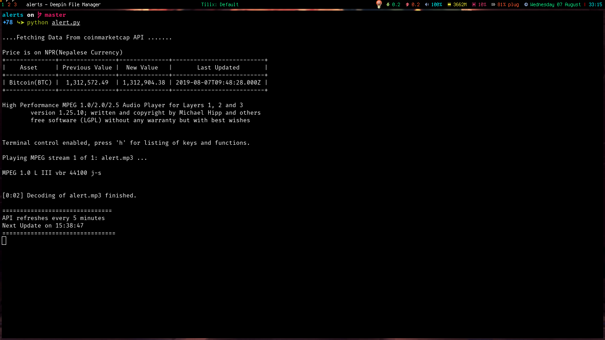

# Gilfoyle-bitcoin-alert
## Api : coinmarketcap <a href="https://coinmarketcap.com/api/documentation/v1/#">coinmarketcap</a>
### Fetches bitcoin price from the alerts.txt When the price is hit then program alerts and updates the file with latest bitcoin value
<ul>
  <li>
The output price is in Nepalese currency(NPR)
  </li>
  <li>Api changes every 5 minute</li>
  </ul>
  

# Silicon Valley Bitcoin alert
